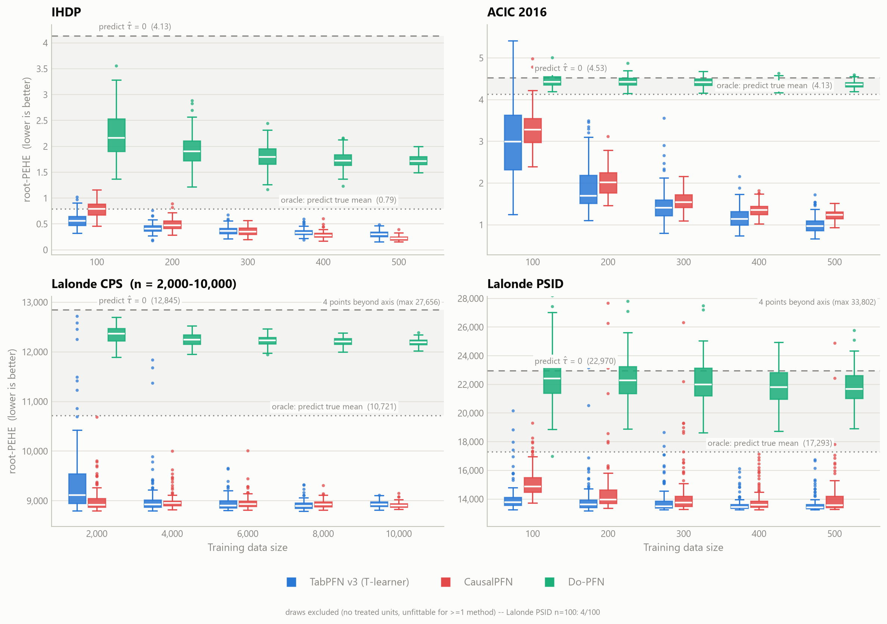
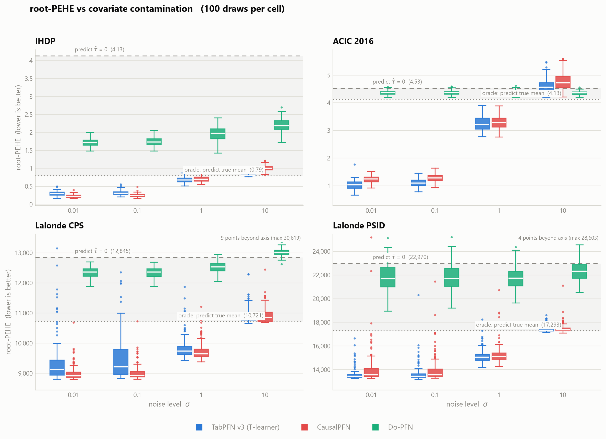

# Benchmarking Tabular Foundation Models for CATE Estimation

[](https://github.com/0u88/cate-benchmark/actions/workflows/tests.yml)

[](LICENSE)

Can a **general-purpose tabular foundation model** estimate heterogeneous treatment effects as
well as models **pretrained specifically for causal inference**? This project benchmarks three
prior-data fitted networks (PFNs), transformers that do approximate Bayesian inference in a
single forward pass, on **conditional average treatment effect (CATE)** estimation:

| Model | Pretraining prior | How it estimates the CATE |
|---|---|---|
| **TabPFN v3** (Prior Labs, 2026) | General tabular prediction | T-learner: τ̂(x) = μ̂₁(x) − μ̂₀(x) |
| **CausalPFN** (Balazadeh et al., 2025) | Synthetic causal data-generating processes | Direct estimation |
| **Do-PFN** (Robertson et al., 2025) | Synthetic structural causal models | Predicts p(y \| do(t), x) |

The benchmark uses four standard datasets (IHDP, ACIC 2016, Lalonde CPS, and Lalonde PSID) and
12,312 model fits. **Poster:** [`poster.pdf`](poster.pdf).

## Quick start

Every figure and table is rebuilt from the committed results. This needs no GPU, models or
datasets:

```bash
pip install -e ".[plot]"
cate-bench plot                     # figures/fig1_sample_size.png, figures/fig2_contamination.png
cate-bench tables                   # results/tables/*.md
cate-bench diagnose effect-scale    # results/diagnostics/effect_scale.md
```

## Research questions

1. How does a general-purpose tabular foundation model compare with causally-pretrained ones?
2. How does CATE accuracy scale with training-set size in the small-sample regime?
3. How robust are these models when the observed covariates carry measurement noise?

## Results

All errors are root-PEHE, √mean((τ − τ̂)²), where lower is better. Two model-free reference
levels anchor every result:

- **Predict-0**: the error of always predicting τ̂ = 0.
- **Oracle**: sd(τ), the error of a constant predictor that already knows the true average effect.
  A method below the oracle has captured genuine effect heterogeneity.

### Experiment 1: Baseline estimation on the full training pool

Root-PEHE divided by the oracle error ([`results/tables/full_pool.md`](results/tables/full_pool.md)).
Values below 1 beat the oracle.

| Model | IHDP | ACIC 2016 | Lalonde CPS | Lalonde PSID |
|---|---|---|---|---|
| TabPFN v3 (T-learner) | 0.417 | **0.102** | 0.837 | **0.770** |
| CausalPFN | **0.198** | 0.176 | **0.827** | 0.784 |
| Do-PFN | 2.126 | 1.040 | 1.134 | 1.225 |

The general-purpose model and the causal specialist are on par: each wins two datasets. Do-PFN
does not beat the oracle on any dataset.

### Experiment 2: CATE vs. training-set size

n = 100 to 500, or 2,000 to 10,000 for Lalonde CPS, where only 1.06% of units are treated.
Each cell has 100 independent training draws.



Median error drops sharply and then levels off at a dataset-specific floor. Beyond that point,
more data still narrows the spread across draws and reduces worst-case error. On IHDP, TabPFN is
better below n ≈ 300 and CausalPFN is better above it.

### Experiment 3: CATE vs. covariate contamination

Noise is added to the covariates only, from σ = 0.01 (essentially clean) to σ = 10 (about 10% of
the original signal left). Training size is fixed: n = 2,000 for Lalonde CPS and n = 500 for the
other datasets.



Causal pretraining gives no robustness advantage. TabPFN and CausalPFN degrade at similar rates on
three of the four datasets; on IHDP, CausalPFN degrades faster. Under extreme noise both approach
the oracle. On ACIC 2016 they end up above the predict-0 line, worse than assuming no effect at all.

## Why Do-PFN fails: a mismatch with its pretraining prior

An amortized estimator can only be as good as the overlap between its synthetic pretraining prior
and the real data-generating process. Do-PFN's failures trace back to two specific gaps in that
overlap. Both diagnostics are in [`src/cate_benchmark/diagnostics/`](src/cate_benchmark/diagnostics/).

**1. It cannot use more covariates than it was trained on.** The Do-PFN v1 checkpoint embeds a
whole row as one token through a `Linear(170 → 192)` layer indexed by column position.
Pretraining only ever filled the first 7 columns (the treatment plus at most 6 covariates), so
the weights for every later column never received a gradient. IHDP has 25 covariates and ACIC
2016 has 58. The prediction is that restricting the input to about 6 covariates should *help*
Do-PFN. It does ([`results/diagnostics/dopfn_width.json`](results/diagnostics/dopfn_width.json);
IHDP, n = 500, mean of 3 random covariate subsets):

| Covariates used | 2 | 4 | 6 | 8 | 12 | 16 | 20 | 25 (all) |
|---|---|---|---|---|---|---|---|---|
| Do-PFN root-PEHE | 0.859 | **0.795** | 0.815 | 1.055 | 1.046 | 1.834 | 1.875 | 1.490 |

With 4–6 covariates, Do-PFN's error nearly halves (1.490 → 0.795) and reaches the oracle level
(0.79). Random subsets can omit key covariates, which is why 16 and 20 are worse than using all 25.
On ACIC 2016, narrowing the input does not help: the error stays at 4.0–4.3 for every width, close
to the predict-0 level of 4.53. That is the second failure mode.

**2. It shrinks large effects.** Do-PFN's prior treats the treatment as one node among many, so
effects that are large relative to the outcome's spread are rare in pretraining. On IHDP, where
sd(τ)/sd(y) is 0.36, Do-PFN's predicted effects vary about as much as the true ones do. On the
three datasets where that ratio is 0.8 or more, they vary only 7–22% as much. The general-purpose
TabPFN compresses far less
([`results/diagnostics/effect_scale.md`](results/diagnostics/effect_scale.md)):

| Dataset | sd(τ)/sd(y) | Do-PFN sd(τ̂)/sd(τ) | TabPFN sd(τ̂)/sd(τ) | CausalPFN sd(τ̂)/sd(τ) |
|---|---|---|---|---|
| IHDP | 0.36 | 1.01 | 1.13 | 0.99 |
| ACIC 2016 | 0.81 | **0.07** | 0.97 | 0.97 |
| Lalonde CPS | 1.10 | **0.13** | 0.66 | 0.54 |
| Lalonde PSID | 1.11 | **0.22** | 0.68 | 0.59 |

The two mechanisms separate cleanly. On IHDP the scale is right, but the uninformative extra
covariates add noise: the error is 1.40 × sd(τ) even after removing the average-effect bias. On
the other three datasets the predictions are compressed toward a constant.

## Experimental design

| | |
|---|---|
| **Data** | CausalPFN's benchmark loaders, realization 0; test sets and ground-truth CATE exactly as CausalPFN publishes them. |
| **Training draws** | Draw r uses `default_rng(r).permutation(pool)[:n]`. The draw is nested in n and identical across numpy versions, so all methods see the same rows even though they run in different environments. Only the training draw varies; the test set is fixed. |
| **Repetitions** | 100 draws per cell in Experiments 2 and 3. |
| **Failed draws** | A draw with too few treated units can be unfittable. It is recorded, and each comparison uses only the draws every method could fit. |
| **Contamination** | Numeric covariates: `x + σ·sd(x)·ε`. Binary covariates are resampled from their empirical marginal with probability p = 1 − 1/√(1+σ²), which gives the same correlation with the clean value, 1/√(1+σ²), as the numeric noise. Gaussian noise would flip TabPFN's column-type detection from categorical to numeric at the first σ. |
| **Metric** | Root-PEHE as defined by CausalPFN, so values are comparable to its published tables. |

## Repository layout

```
cate-benchmark/
├── src/cate_benchmark/
│   ├── config.py          the four experiments, datasets, methods and paths
│   ├── data.py            dataset loading and the nested training draws
│   ├── estimators.py      TabPFN T-learner, CausalPFN, Do-PFN behind one interface
│   ├── contamination.py   covariate-noise model
│   ├── runner.py          one resumable runner for every experiment
│   ├── results.py         result storage and the common-draw comparison
│   ├── tables.py          result tables
│   ├── plotting/          Figures 1 and 2
│   ├── diagnostics/       the two Do-PFN diagnostics
│   └── cli.py             `cate-bench` command
├── results/
│   ├── full-pool/ sample-size/ sample-size-large/ contamination/   per-fit results (JSON)
│   ├── datasets.json      dataset statistics and reference levels
│   ├── tables/            generated tables
│   └── diagnostics/       diagnostic outputs
├── tests/                 unit tests and integrity checks on the committed results
├── figures/               the two poster figures
├── requirements/          pinned environments
├── third_party/           Do-PFN compatibility patch
└── poster.pdf
```

## Reproducing the experiments

**1. Clone the upstream model repositories** at the commits used in this study:

```bash
git clone https://github.com/vdblm/CausalPFN third_party/CausalPFN
git -C third_party/CausalPFN checkout 7da4afa
git clone https://github.com/jr2021/Do-PFN third_party/Do-PFN
git -C third_party/Do-PFN checkout 90d6743
git -C third_party/Do-PFN apply ../dopfn.patch
```

The patch fixes hard-coded cluster paths, adds a missing import, and follows a scikit-learn
parameter rename.

**2. Create the two environments.** CausalPFN's dependencies need Python 3.10. For CUDA, see the
header of each requirements file.

```bash
python3.12 -m venv .venv-tabpfn    && .venv-tabpfn/bin/pip install -r requirements/tabpfn-dopfn.txt -e .
python3.10 -m venv .venv-causalpfn && .venv-causalpfn/bin/pip install -r requirements/causalpfn.txt -e .
```

TabPFN v3 needs an access token from [Prior Labs](https://priorlabs.ai). CausalPFN downloads its
weights on first use. On macOS, set `OMP_NUM_THREADS=1` for the CausalPFN environment: it
bundles several copies of OpenMP, which otherwise crash on model loading.

**3. Run.** Each experiment is resumable: re-running a command skips finished cells.

```bash
cate-bench list
for m in tabpfn_t dopfn; do .venv-tabpfn/bin/cate-bench run sample-size --method $m; done
.venv-causalpfn/bin/cate-bench run sample-size --method causalpfn
# likewise for full-pool, sample-size-large and contamination
```

**Verification.** Experiment 1 for Do-PFN and CausalPFN was re-run on CPU (macOS) with this code.
It reproduces the committed results to within a relative error of 2 × 10⁻⁵; those results were
originally computed on Windows, with CausalPFN on GPU. The plotting code rebuilds figures from `results/` that are
byte-identical to what the original scripts produced, and the test suite checks that the committed
tables match the results they are built from.

## Tests

```bash
pip install -e ".[dev]"
ruff check . && pytest
```

The tests cover the metrics, the sampling, the contamination model, and the runner (using a fake
model). They also check the committed results: every planned cell is present exactly once, and
the Experiment 1 table matches the poster.

## Limitations

- One realization per dataset: box spreads reflect training-sample variability, not variability
  of the data-generating process.
- Only the public Do-PFN v1 checkpoint could be tested; the v1.1 model in the paper is not
  released.
- Experiment 1 is a single fit per dataset, so its table has no error bars.
- This is an evaluation study; it does not propose a new estimator.

## References

- Hollmann et al. (2025). *Accurate predictions on small data with a tabular foundation model.* Nature 637.
- Grinsztajn et al. (2026). *TabPFN-3: Technical report.* arXiv:2605.13986.
- Balazadeh et al. (2025). *CausalPFN: Amortized causal effect estimation via in-context learning.* NeurIPS 2025.
- Robertson et al. (2025). *Do-PFN: In-context learning for causal effect estimation.* NeurIPS 2025.
- Hill (2011), IHDP; Dorie et al. (2019), ACIC 2016; LaLonde (1986) and Dehejia & Wahba (1999), Lalonde.

The datasets are not redistributed; they are loaded through the CausalPFN repository under
their original terms.

## Author

**Chia-Yu Ou**, Department of Information Management and Finance, National Yang Ming Chiao Tung
University (NYCU). Summer research project, 2026, supervised by Dr. Tso-Jung Yen.

## License

[MIT](LICENSE)
